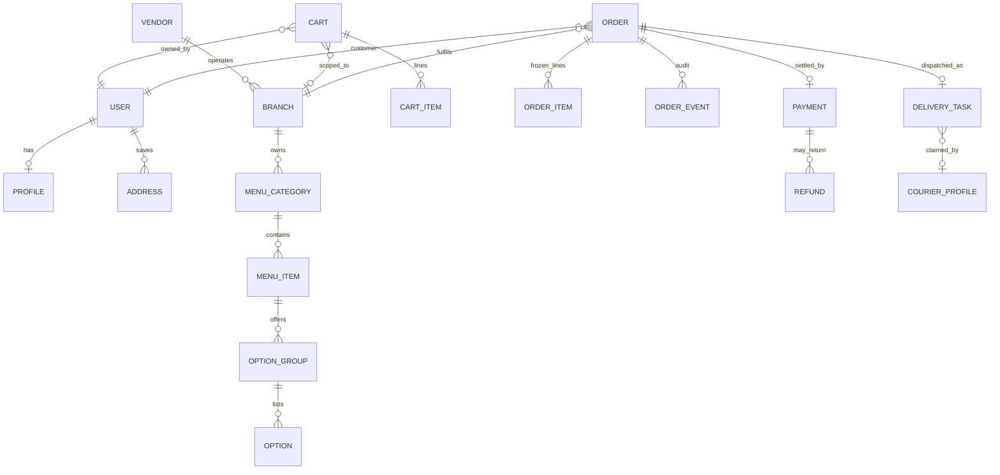
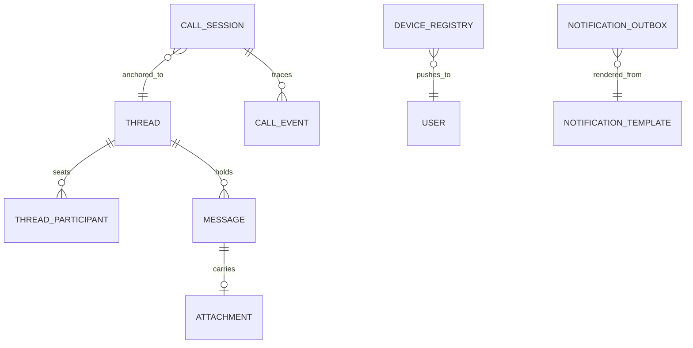

# PlateRoute — Backend Architecture and Design
Companion to PROJECT_PLAN.md; authoritative for technical decisions.

| Field | Value |
| --- | --- |
| Document | docs/ARCHITECTURE.md |
| Version | 1.0 |
| Date | 2026-08-27 |
| Status | Draft for review |

---

## 1. Charter

Specifies how the FoodPanda-style platform is engineered: runtime topology, Django app decomposition, physical database design, geo strategy (Google Maps versus free alternatives), realtime transport, direct messaging, and voice calling. The plan says what and when; this document says how and why. Technical conflicts resolve here; product scope lives in the plan.

Design principles:

1. Modular monolith first; strict app boundaries so extraction into services stays mechanical.
2. Contract-first at every seam: OpenAPI governs REST; typed payloads govern async hops; WebSocket consumers mirror REST outcomes and never mutate domain state alone.
3. Money, availability, and placement are facts captured once via snapshots; later edits never rewrite history.
4. Every external capability sits behind a narrow port so vendors are replaceable defaults.
5. Free and self-hostable first in development; managed services only where their cost buys reliability we cannot operate yet.

## 2. System Context

```
   Customers ---> |                   | ---> Restaurants (owners/staff)
   Courier   ---> |   PlateRoute      | ---> Payment providers (Stripe, bKash, Nagad)
   Operators ---> |   Platform        |
                  +----+---------+----+
                       |         |
          Maps/routing |         | Notification networks
        (GCP or OSM)   v         v  (FCM, SMS gateway, email provider)
```

| Actor | Surface |
| --- | --- |
| Customer | Flutter customer app; REST plus WebSocket for tracking and chat |
| Restaurant owner/staff | Flutter merchant app; REST plus WS board updates |
| Courier | Flutter courier app; REST for shifts/tasks, WS offers, background location posts |
| Operations staff | Web back office served by this backend (admin extended plus dashboards) |
| PSPs | Inbound server-to-server webhooks; outbound calls made by workers only |

## 3. Containers

```
Flutter x3 --HTTPS /api/v1--+                    +-- gunicorn sync HTTP tier
Flutter    --WSS  /ws-------+--> LB/WAF ----->  ASGI tier (Django Channels)
Flutter <--media UDP/SRTP-- LiveKit SFU              |
                                                     v
                     Redis: cache | channels layer | celery broker
                                |
                        PostgreSQL (+PostGIS) primary; replica at growth trigger
                                |
             Celery workers (queue-partitioned) + beat scheduler
                                |
  External: Stripe/bKash/Nagad | FCM/SMS/Mail | Geo stack | S3 bucket
            LiveKit server | coturn | Sentry
```

| Component | Responsibility | Notes |
| --- | --- | --- |
| HTTP tier | CRUD, search reads, checkout transactions | gunicorn, stateless, horizontal autoscale |
| ASGI tier | WS consumers: order tracking, chat, presence | Separate process family from HTTP scaling |
| Worker tier | Mail, push fanout, dispatch timers, webhooks, reconciliation, aggregates, geo lookups | Queue partitioning keeps payment backlog off order timers |
| Beat | Sole owner of periodic schedules | Single-instance leadership via redis lock |
| PostgreSQL | System of record | PostGIS geometry, pg_trgm search, citext emails |
| Redis | Cache, channels layer, broker, locks, rate buckets | Persistence on for broker DB only |
| LiveKit SFU | Voice-call media plane | Self-hosted docker; tokens minted by Django |
| coturn | TURN/STUN relay for WebRTC reachability | Ephemeral credentials issued through Django API |
| Object storage | Menu images, chat attachments, proof of delivery | Signed direct uploads; backend never proxies bytes |

## 4. Django Application Catalogue

App names are snake_case; `common` cannot collide with the existing settings package `core`.

| # | App | Owns (models) | API surface | Depends on |
| --- | --- | --- | --- | --- |
| 1 | accounts (exists) | User, Profile(token_version), PasswordResetOTP, EmailVerification, DeviceRegistry moved here later | register/login/refresh/OTP reset/profile/email-change/deletion/devices | common |
| 2 | addresses | Address book rows, GeocodeCache | address CRUD, autocomplete proxy, default selection | accounts, common |
| 3 | vendors | Vendor(brand), Branch, BranchHours, ClosureNotice, VendorStaff memberships, payout account reference | vendor onboarding and KYC state machine, staff invites, hours management | accounts, addresses, common |
| 4 | menus | MenuCategory, MenuItem, OptionGroup, Option, AvailabilityWindow, MenuItemTag(allergen/cuisine) | owner menu CRUD, bulk import jobs, availability toggles | vendors, common |
| 5 | discovery | read models only: SearchDocument cache, HomeFeedRanking weights | search, nearby list, home rails, cuisine browse | vendors, menus, addresses, common |
| 6 | promotions | Coupon, Campaign, RedemptionLedger | coupon validate/apply preview, admin campaign mgmt | common |
| 7 | carts | Cart, CartItem, PricingService domain logic | cart CRUD, quote endpoint returning PriceBreakdown | menus, promotions, vendors, addresses, common |
| 8 | orders | Order, OrderItem, OrderEvent(audit), IdempotencyRecord | place checkout, my-orders, restaurant queue operations, guarded transitions with reasons | carts, addresses, vendors, promotions, common |
| 9 | payments | PaymentGateway ports, Payment, Refund, LedgerEntry, Invoice, WebhookEvent | hosted-checkout session creation, COD settle simulation, webhook receivers, refund approvals | orders, common |
| 10 | delivery | DeliveryTask, DeliveryOffer, CourierShift, LocationPing, DispatchPolicy, EtaSnapshot | courier shift/task APIs, dispatch loop entries, tracking feeds | orders, addresses, accounts, common |
| 11 | chat | Thread, ThreadParticipant, Message, MessageAttachment, ModerationReport | REST message CRUD scoped to participants, WS consumers, reports | orders(scope), accounts, notifications, common |
| 12 | calls | CallSession, CallEvent; LiveKitClient port | start/accept/decline/end APIs, TURN credentials endpoint, LiveKit webhook receiver | chat(participants), orders(scope), accounts, common |
| 13 | notifications | ChannelAdapters(email/sms/push), NotificationTemplate, NotificationOutbox | internal send service for other apps; device registry lives here at M1 | accounts, common |
| 14 | reviews | Review, ReviewReply, RatingAggregate | submit/list reviews, aggregate embeds in catalog payloads | orders, vendors, accounts, common |
| 15 | support | SupportTicket, TicketMessage link, SLAState | ticket open/update/list for users and operators | orders, chat, accounts, common |
| 16 | analytics | nightly summary tables, KPI views | operator and merchant reporting endpoints | explicitly declared read deps |
| 17 | backoffice | orchestrating serializers only | ops boards, force transitions, fraud/refund queues, config bridge | everything, read-mostly |
| 18 | common | TimeStampedModel, UUIDModel, RuntimeConfig, OutboxMessage, money utils, exceptions, GeoProvider port | shared kernel; only runtime-config read endpoint | nothing |

Boundary rules (CI-linted, review-blocking):

1. Imports point downward only in the listing order. Upward communication happens exclusively through emitted events.
2. No cross-app ORM joins inside views. Screens needing joins get a projection service from the owning app, or the read belongs to analytics/backoffice.
3. Side effects announce via OutboxMessage rows committed in the same transaction as state changes; workers translate outbox rows into pushes, deliveries, and WS broadcasts. At-least-once with outbox-id dedup removes signal spaghetti.
4. Money math exists only in the pricing service (carts) and settlement routines (payments).
5. State machines exist only in orders, payments, and delivery trip state; others consume recorded transitions.
6. Vendor-swappable integrations implement ports defined in the consuming app's `ports.py`; adapters live beside them selected by environment configuration.

## 5. Request Paths and Async Inventory

Synchronous happy path for checkout (illustrative):

```
Client -> POST /api/v1/orders (Idempotency-Key) ->
  carts.quote() revalidated -> orders.place(): insert Order+Items+OrderEvent,
  mark coupon redeemed, persist IdempotencyRecord+OutboxMessage('order.placed'),
  all in ONE transaction -> 201 snapshot returned.
Worker: outbox pump publishes order.placed -> payments(if capture),
  notifications(mails/push), delivery(pre-arm dispatch on READY later),
  chat(thread bootstrap). WS broadcast notifies merchant app instantly.
```

Celery queues and their consumers:

| Queue | Jobs | Concurrency note |
| --- | --- | --- |
| mail | transactional email send, template render | low; separate so SMTP latency never starves orders |
| push | FCM fanout per device with chunking and retry curve | medium |
| dispatch | accept-timer expiry checks, offer expiry cascades, courier ping TTL pruning | latency-sensitive worker pool |
| webhooks | PSP event processing end to end after fast-ack | isolated from user traffic |
| media | image processing/scan hooks, bulk menu imports | CPU-bound, single-slot tenancy |
| geo | geocode/route lookups with cache fills | rate-limit-aware pacing toward free providers |
| reconcile | daily settlement diffs, aggregates rebuild | scheduled beat only |
| callswebhook | LiveKit room lifecycle ingestion | tiny |

Retry policy uniform: exponential backoff capped at 5 attempts then dead-letter queue rows inspected via backoffice screens.

## 6. Realtime Transport (WebSocket Fabric)

WebSocket routing table:

| Path | Consumer | Authz model | Emits |
| --- | --- | --- | --- |
| /ws/orders/{uuid}/ | OrderTrackerConsumer | participant of that order (customer, assigned courier, vendor staff member, operator) | order.status_changed, eta.updated, task.offered/claimed snapshots |
| /ws/chat/{thread_uuid}/ | ChatConsumer | active ThreadParticipant | message.created, message.read watermark deltas, typing pings (transient, not persisted) |
| /ws/presence/ | PresenceConsumer | any authenticated user | lightweight acks; used to mark device online windows |

Handshake uses the same bearer JWT as REST passed in the `Authorization` header during upgrade plus an `X-App-Version` check; connection is closed server-side when token_version bumps. All payloads are small JSON envelopes `{type, data, ts}`; anything heavier stays REST-plus-outbox.

## 7. Database Design

### 7.1 Global conventions

| Concern | Rule |
| --- | --- |
| Primary keys | `BIGINT GENERATED ALWAYS AS IDENTITY`; public-facing rows additionally expose non-guessable `uuid` (default gen_random_uuid) unique-indexed for URLs and payloads |
| Money | integers in minor units, column suffix `_minor`, always paired with ISO `currency CHAR(3)`; CHECK (col >= 0) unless negative is meaningful (refunds ledger) |
| Time | `timestamptz` everywhere; USE_TZ stays true |
| Enums | Django TextChoices persisted as varchar with DB-level CHECK constraints; no PostgreSQL enums (migration pain) |
| Geo | `geometry(Point, 4326)` via PostGIS on branches, addresses, pings, eta snapshots; decimal lat/lng mirror columns kept for cheap API serialization |
| Emails | `citext` lowercased uniqueness at database level matching manager behavior |
| JSONB | snapshots and config blobs `NOT NULL DEFAULT '{}'::jsonb`; schema documented per model |
| Soft delete | only on accounts/user-linked tables (nulls personal fields), everything else uses state enums with audit trail |
| Indexes | FKs indexed by default; composites listed per table below; GIN trigram on search texts; partial indexes for hot predicates (unpaid orders, live tasks, unread threads) |
| Extensions | postgis, pg_trgm, btree_gin, citext required; none optional |

### 7.2 Core ERD (ordering triangle)



### 7.3 Communication ERD



## 8. Physical Data Dictionary

Notation per table: `column TYPE flags` where flags = U unique, I index, P partial index, F foreign key target, J jsonb default blank, C check constraint. Timestamps `created_at/updated_at` implied everywhere and not repeated.

### 8.1 accounts

| Table | Columns |
| --- | --- |
| accounts_user | email CITEXT U; password; role varchar C in(customer,vendor,courier,operator,admin); is_active; is_staff; date_joined; uuid U; deleted_at nullable P(partial on null) |
| accounts_profile | user F UQ; token_version BIGINT default 0; locale varchar(8); prefs J |
| password_reset_otp | user F; code_hash CHAR(64) I; expires_at; used bool | existing, unchanged |
| email_verification | user F; token_hash CHAR(64) I; expires_at; verified_at nullable |
| device_registry | user F; fcm_token TEXT U; platform C in(android,ios); app_version; last_seen_at; I(user,last_seen_at desc) |

### 8.2 addresses

| Table | Columns |
| --- | --- |
| addresses_address | user F; label; receiver_name; phone; geo geometry(Point,4326) GIST-I; lat DEC(9,6); lng DEC(9,6); plus_code TEXT nullable; street; area; city; postcode; directions; is_default bool C single-default via partial U(user) WHERE is_default |
| addresses_geocache | provider C in(gcp,osm); input_hash SHA256 U with provider; result J; fetched_at; ttl_expires_at |

### 8.3 vendors

| Table | Columns |
| --- | --- |
| vendors_vendor | owner F users_user; name; slug U; legal_name; trade_license_no; cuisines TEXT[] GIN-I; logo file ref; status C(draft,pending,approved,paused,suspended); commission_bp INT smallint basis points; payout_account_ref; kyc_state J |
| vendors_branch | vendor F; name; geo Point GIST-I; lat/lng mirrors; address_text; city_area; phone; prep_minutes_default SMALLINT; min_order_minor BIGINT C>=0; currency CHAR(3); open_hours J (weekly matrix); avg_rating NUM(3,2) denorm; rating_count INT; is_accepting bool; deleted_at null |
| vendors_branch_hours | branch F; weekday SMALLINT C 0-6; opens TIME; closes TIME; U(branch,weekday,opens) |
| vendors_closure | branch F; starts_at; ends_at; reason; I(branch,starts_at) |
| vendors_staff | branch F; user F; role C(owner,manager,staff); invited_by F nullable; accepted_at nullable; U(user,branch) active-only partial |
| vendors_payout_account | vendor F UQ-active partial; PSP ref fields; verified_at |

### 8.4 menus

| Table | Columns |
| --- | --- |
| menus_category | branch F; name; position SMALLINT; U(branch,name_lower) |
| menus_item | category F; branch F denorm fast filters; name; description; image_ref; base_price_minor BIGINT C>=0; currency; available bool default true; sort_key; tags TEXT[] GIN; search_tsv tsvector GENERATED ALWAYS stored GIN; deleted_at null |
| menus_option_group | item F; title; min_select SMALLINT C>=0; max_select SMALLINT C>=min_select; position |
| menus_option | group F; label; price_delta_minor BIGINT C>=0; is_default bool; position; availability toggle |
| menus_availability_window | item F nullable; group-level override via item_group FK nullable one-of; weekdays[] SMALLINT; from_time; to_time; date_override nullable; purpose C(in,out) black/white listing |
| menus_import_job | branch F; requested_by F; file_ref; state C(received,parsed,failed,applied); error_report J; applied_count |

### 8.5 promotions

| Table | Columns |
| --- | --- |
| promotions_coupon | code CITEXT U; kind C(percent,fixed,free_delivery); value INT (bp for percent, minor for fixed); branch_scope FK nullable NULL=global; starts_at; ends_at; max_redemptions; per_user_limit; min_basket_minor; active bool; meta J |
| promotions_campaign | sponsor F vendors_vendor nullable; budget_minor; spent_minor; targeting J |
| promotions_redemption | coupon F; user F; order F nullable until placed flow binds; redeemed_at; U(coupon,user,order) |

### 8.6 carts

| Table | Columns |
| --- | --- |
| carts_cart | user F U; branch F nullable; updated_marker |
| carts_cartitem | cart F; menu_item_ref BIGINT I; title_snapshot; unit_price_snapshot_minor C>=0; qty SMALLINT C 1..50; selected_options J list of {group_id, option_id, price_delta_minor}; line_total_minor GENERATED stored = unit*qty |
| idempotency_records | user F; key VARCHAR(64); endpoint_hash; request_fingerprint SHA256; response_status SMALLINT nullable; response_body_ref; state C(open,completed,replayed_conflict); created gap window pruned after 24h; U(user,key) P partial |

Pricing rule storage stays in code (deterministic service) + RuntimeConfig knobs; no pricing rows in DB by design so logic diffing lives in git.

### 8.7 orders

| Table | Columns |
| --- | --- |
| orders_order | uuid U; customer F; branch F; status C(placed,accepted,preparing,ready,picked,out,delivered,rejected,cancelled_customer,cancelled_restaurant,cancelled_platform,failed_payment,refund_pending,refunded) I composite P(hot set); currency; items_total_minor; discount_minor C>=0; delivery_fee_minor; vat_minor; tip_minor; grand_total_minor; address_snapshot J{line,city,lat,lng,instructions}; voucher_ref F nullable snapshot J; eta_snapshot J{prep_minutes,minutes_to_pickup,minutes_to_dropoff,computed_at}; placed_at I; accepted_at; delivered_at; cancel_reason_code; accepted_by F users_user nullable; external_ref U nullable |
| orders_item | order F; menu_item_ref BIGINT; title_snapshot; qty SMALLINT; unit_price_minor; options_snapshot J; line_total_minor generated |
| orders_event | order F; seq BIGINT U(order,seq) enforced monotonic via trigger-less service insert lock on order row; from_status; to_status; actor_type C(customer,vendor,courier,system,operator); actor_id nullable; reason_code; payload J; I(order,-created_at) BRIN candidate at scale |

Note: chat threads bootstrap lazily against an order uuid; no order-side column needed for messaging.

### 8.8 delivery

| Table | Columns |
| --- | --- |
| couriers_profile | user F UQ; vehicle_type C(bike,bicycle,car); plate_no; license_no; is_online bool default false; last_online_at; capacity_small INT default 1; home_zone geometry nullable |
| couriers_shift | courier F; started_at; ended_at nullable; device_id; P overlap guard via exclusion constraintgist(period && period) where same courier |
| delivery_task | order F UQ; state C(created,offering,claimed,at_vendor,picked,arrived,dropped,cancelled,expired_no_courier); pickup_geo Point GIST-I; dropoff_geo Point GIST-I; promised_eta_minutes; courier_fee_minor; tip_minor_courier_share_bp; claimed_at; picked_at; dropped_at; I(state,geo) GiST for spatial dispatch queries |
| delivery_offer | task F; courier F; offered_at; expires_at; state C(sent,viewed,accepted,declined,expired); response_ms INT nullable; U(task,courier) |
| location_ping | courier F; task F nullable; geo Point; speed_mps SMALLINT; heading_deg SMALLINT; recorded_at BRIN-I; monthly RANGE partitions on recorded_at with pg_partman, 30-day retention job drops partitions |
| eta_snapshots | task F; payload J{to_pickup_min,to_dropoff_min,provider,distance_m,polyline_ref}; computed_at I |

Dispatch algorithm note: nearest-K (K=6 radius expansion by density buckets) online couriers within zone polygon using spatial index; offers expire per RuntimeConfig `delivery.offer_ttl_seconds` cascade excluding decliners of current round; dispatcher force-assign writes claim directly plus audit event.

### 8.9 payments

| Table | Columns |
| --- | --- |
| payments_payment | order F UQ one-live-then-history pattern: only latest active per order partial U(order) WHERE state IN(pending,authorized); gateway C(stripe,cod,bkash,nagad); gateway_reference TEXT nullable U; amount_minor; currency; state C(initiated,requires_action,pending,authorized,captured,failed,voided); brand_last4; executed_by_actor C(customer,system,operator); captured_at |
| payments_refund | payment F; amount_minor C>0 <= payment capture; reason_code C(mistake,item_issue,late,no_show,goodwill); state C(requested,approved,processing,succeeded,failed); requested_by F; approved_by F nullable operator; processed_at; psp_refund_ref U nullable |
| ledger_entries | entry_type C(order_capture,platform_commission,courier_payout,vendor_settlement,tip_transfer,refund_out,adjustment); order F nullable; payee_type+payee_id polymorphic-ish constrained CHECK combos; amount_minor signed (double-entry pairs share batch_uuid U within pair); currency; settled_period DATE I; reconciliation_state C(auto,flagged,resolved) |
| invoices | order F UQ; series CHAR(6); number INT; full_number GENERATED 'BD-2026-000123' style U; issued_at; pdf_object_ref |
| webhook_events | provider C; event_id TEXT U(provider,event_id); signature_verified bool; payload J; received_at; processing_state C(received,processed,ignored,dead) I partial backlog monitor; retries INT |

Capture mode policy: authorize-on-place for card, capture-at-accept to reduce refund churn (config switch). COD rows behave identically in ledger with settlement batch markers so reporting never special-cases cash.

### 8.10 chat

| Table | Columns |
| --- | --- |
| chat_thread | uuid U; kind C(order,support,vendor_general); order F nullable where kind=order UQ partial on kind; subject; last_message_at denorm I(desc); message_count INT denorm; created_by F; closed_at nullable; closed_reason_code |
| chat_participant | thread F; user F; role C(customer,vendor_staff,courier,operator); joined_at; left_at nullable P(active participants only); last_read_message_id BIGINT F nullable watermark (unread = messages.id > watermark AND sender<>me); muted_until timestamptz null; U(thread,user) active-partial |
| chat_message | id BIGSERIAL shared sequence orderable; thread F; sender F; kind C(text,image,file,system,event); body TEXT C length<=4000 when text; reply_to F self nullable one-level; meta J (e.g., delivery task snapshot for event cards); hidden_at nullable moderation; I(thread,id DESC) primary access path; monthly RANGE partitions by created_at with pg_partman once volume warrants (documented switch point 5M rows) |
| chat_attachment | message F UQ; object_key; mime C whitelist(images png/jpg/webp, pdf for support); size_bytes C <=8388608; width/height nullable; scan_state C(pending,clean,flagged) default pending for vendor General threads only |
| chat_report | message F; reported_by F; reason_code; resolved_by F nullable operator; outcome C(removed,dismissed,no_action) |

Unread model deliberately watermark-based (O(participants) not O(messages)): unread count computed as `COUNT(*) WHERE thread= T AND id > participant.watermark AND sender != user` served from covering index `(thread_id, id)`.

### 8.11 calls

| Table | Columns |
| --- | --- |
| calls_session | uuid U room name; kind C(order_voice,support_voice); thread F nullable; initiator F; callee F; status C(ringing,accepted,declined,busy,missed,ended,failed); scope_object_type/id CHECK-combined pair constraining who may call at which lifecycle stage; started ringing_at; connected_at; ended_at; duration_secs generated stored; end_reason_code; ended_by actor; livekit_room metadata J {room_name, node_hint} |
| calls_event | session F; type C(invite_sent,rung,accepted,declined,busy,media_connected,reconnecting,media_lost,participant_left,room_ended); occurred_at I(session); payload J; source C(app,livekit_webhook) |

No call audio or recordings are persisted in v1 (ADR DR-003). Sessions and events exist for metrics, abuse control, and order-timeline chips ("Voice call 02:14").

### 8.12 notifications

| Table | Columns |
| --- | --- |
| notifications_template | code U(send_order_placed_vendor, otp_reset, task_offer, ...); channel C(email,push,sms); locale; subject; body_ref versioned template pointer; active |
| notification_outbox | id BIGSERIAL; dedup_key TEXT U nullable idempotency for fanout storms; channel; recipient user F nullable plus address blob J for guests; template F; context J; state C(queued,sending,sent,failed,dead) I partial backlog; attempts SMALLINT; scheduled_at; sent_at; provider_message_id |
| notification_preference | user F; kind C(marketing,order_updates,courier_alerts); email bool; push bool; sms bool; quiet_hours J |

Outbox pattern is generic in `common` and rows live here because all sends funnel through this app.

### 8.13 reviews

reviews_review: order F UQ; restaurant_stars SMALLINT C 1..5; courier_stars nullable same CHECK; body VARCHAR(1000); hidden_at moderation null; aggregate mirrors maintained on vendors_branch via signals-originated tasks.
reviews_reply: review F UQ one per reviewer side; author F vendor member or courier; body.

### 8.14 support

support_ticket: uuid U; order FK nullable; opened_by F; category C(order_issue,refund_request,account,other); priority C(low,normal,high,urgent); status C(open,in_progress,waiting_customer,resolved,reopened); sla_due_at I partial open-only; assigned_to operator nullable.
support_message: ticket F; sender F; body; internal_note bool operators-only visibility.

### 8.15 analytics / backoffice / common

analytics_daily_branch_metrics: date, branch F U(date,branch); orders_count, gmv_minor, aov_minor computed stores; completion_ratio NUM(5,4); cancels_by_reason J; avg_accept_secs; prep_p50/p90 secs.
analytics_courier_daily: courier F; date U pair; drops INT; online_minutes; acceptance_rate; earnings_minor.
backoffice has no owned domain tables except thin `ops_action_log` mirroring AuditLog inserts performed through its views.
common_runtime_config: key CITEXT U; value JSONB; description; updated_by F; version BIGINT optimistic-lock counter. Reads cached 30s in Redis with explicit bust endpoint.

## 9. Geo Stack Strategy

Answer to "Google vs free": Google Maps Platform does include free usage tiers (Maps SDK loads and a monthly platform credit), but every project requires an attached billing account before keys function, and autocomplete-heavy flows bill per session above included quotas. Therefore we build provider-agnostic from day one:

- Development and testing run on a fully keyless OSM stack (openstreetmap raster tiles or OpenFreeMap vectors, Photon for geocoding, self-hosted OSRM for routing).
- Google becomes a drop-in adapter activated by environment variable when commercial-grade routing/places quality is needed at scale — no client or domain changes required.

Provider mapping matrix:

| Capability | Google product | Free/dev alternative | Production default |
| --- | --- | --- | --- |
| Map rendering in Flutter | Maps SDK (billing-gated; generous free tier) | flutter_map over OSM/OpenFreeMap tiles, zero keys | Keep OSM stack unless brand needs Google look; both behind MapPane widget interface |
| Address search/autocomplete | Places Autocomplete API | Self-hosted Photon (Komoot) container fed by BD extract; 1rps polite; frontend debounce 300ms | Photon even in prod initially; upgrade path documented |
| Reverse geocode pin drops | Geocoding API | Photon reverse endpoint via same service | same adapter |
| Distance/duration matrices | Distance Matrix API | OSRM `/table` service self-hosted docker on country extract (~2GB RAM for Bangladesh car profile) | OSRM is production-proven; revisit when multi-destination batching grows |
| Turn-by-turn deep link | Google Maps app URL scheme | geo: URI / apple maps schemes via url_launcher | unchanged either way |
| Static snapshot images | Static Maps API | django-static-maps style tile mosaic renderer, cached | optional |

Port design (all lookups cache-first):

```
GeoProvider port methods:
  forward(query, near=None) -> [PlaceSuggestion]
  reverse(lat, lng) -> Place
  route(from_point, to_point, mode='bike') -> RouteResult(distance_m, duration_s, polyline)
  matrix(origins[], destinations[]) -> DurationMatrix
Implementations: GoogleGeoProvider, OsmGeoProvider(photon+osrm), NullGeo(haversine)
Selection: settings.GEO_PROVIDER env; per-capability override map allowed.
Caching: GeocodeCache table keyed sha256(normalized_input)+provider,
TTL 30d addresses / 24h routes; memoized Redis layer in front for hot tiles math.
Rate budgeting: token bucket per provider caps calls/sec; OSM tile policy respected
(attribution mandatory in app UI; bulk download forbidden).
```

ETA composition (provider-independent): `eta_total = prep_minutes(branch) + travel(pickup segment, live courier pos) + travel(dropoff segment) + buffer_by_traffic_bucket`. Provider only supplies `duration_s`; business buffers live in config so switching vendors cannot change product behavior silently.

Google-specific compliance note if/when enabled: restrict API keys by Android package name/iOS bundle id and server IP; never log raw user queries beyond hashed cache input; respect the 30-day storage limit on Places-derived content except customer-saved addresses (treated as user-entered facts, stored deliberately).

## 10. Direct Messaging Design

Purpose: eliminate phone-number exchange, keep every conversation anchored to business context, and give support full replay context without exposing PII beyond need.

Thread scopes created automatically:

| Scope | Members | Created when | Auto-close |
| --- | --- | --- | --- |
| Order thread | customer, branch staff on duty (vendor members), assigned courier once claimed | order ACCEPTED event | DELIVERED +24h then read-only |
| Support thread | customer/user, operators | ticket creation or in-chat escalate action from an order thread (transcript forwarded) | ticket resolved +7d |

Permission matrix (send rights by thread role):

| Sender \ Recipient visible | text | image | call button (see section 11) |
| --- | --- | --- | --- |
| Customer -> vendor staff | yes while order active through delivered+24h | yes | yes during active fulfillment window |
| Customer -> courier | yes between claim and dropped+30min | no (fraud/phishing reduction) | yes in same window |
| Vendor -> courier | indirect only via shared order thread visibility, not a DM edge | no | operator-initiated only |
| Operator -> anyone | always inside scope threads | yes | yes with audit reason |

Messages outside permitted windows are rejected at API layer with domain error `thread.closed`, and the UI hides the composer accordingly — the rule lives once, server-side.

REST surface:

| Method Path | Purpose | Notes |
| --- | --- | --- |
| GET /api/v1/chat/threads | list my threads with unread counts, last message preview | cursor pagination by last_message_at |
| POST /api/v1/chat/threads/order/{order_uuid} | get-or-create the order thread | idempotent bootstrap |
| GET /api/v1/chat/threads/{uuid}/messages?before_id= | paged history, newest last rendered after reverse fetch | cap page size 50; system/event cards included |
| POST .../messages | send text or attachment reference | multipart for inline image; returns canonical message payload |
| POST .../read | advance my watermark to given message id | watermark monotonic guard |
| POST .../attachments | signed-upload negotiation returning object key + fields | client uploads straight to bucket; backend registers metadata |
| POST .../report | moderation report | auto-hides when threshold N distinct reporters reached pending review |
| GET /ws/chat/{thread}/ | realtime stream | consumer mirrors REST-created messages only |

Realtime behavior details:

- Delivery of new messages to online participants happens via channels group `chat.thread.{uuid}` from the outbox worker (`message.created` broadcast), so WS is a mirror, never the writer: offline users converge through normal sync endpoints with watermarks.
- Typing indicators are ephemeral Redis publishes (`TTL 6s`) never hitting Postgres.
- Presence windows derived from `PresenceConsumer` heartbeats set `presence:{user}` redis keys with 90s expiry; rings/calls use this to choose push-vs-WS delivery path (section 11).
- Push fallback: outbox emits FCM high-priority data message containing thread uuid and preview truncation policy per recipient preferences and quiet hours; merchants get critical alerts bypassing quiet hours while their shift toggle is on.

Safety, abuse control, performance:

- Text length cap 4000 chars, link posting restricted until vendor KYC approved (anti-phishing); URL allowlisting applied to merchant General threads.
- Rate limits: 60 messages/min/user/thread token-bucket plus global per-user 240/min; image attachments max 8MB converted client-side to WebP where possible.
- No E2EE in v1 by design: moderation, support replay, and legal hold require server readability; transport security TLS everywhere; this matches incumbent food-delivery norms and is stated in-app privacy copy. Decision recorded as DR-004-open item if regulators ask later.
- Retention: bodies 24 months hot then archived to cold storage with redaction pass for deleted accounts; attachments lifecycle-managed at the bucket level (IA tier after 90 days).
- Partition switch documented at 5M rows on chat_message (monthly ranges); thread listing query shapes stay index-covered before that point.

## 11. Voice Calling Design (1:1, in-app)

Goal: FoodPanda-style "call the rider / call the restaurant" button inside order and chat screens with zero phone numbers exchanged — an operator-controlled data-voice product, not a telecom feature.

Stack decision matrix:

| Option | Cost profile | Control | Verdict |
| --- | --- | --- | --- |
| Raw WebRTC P2P + coturn only | free infra | we own signaling/reconnect/error UX fully | rejected for MVP: mobile NAT churn makes ~20% calls need engineered recovery we would hand-roll badly at first |
| Managed CPaaS (Agora/Twilio/Daily) | per-minute metered, fast | limited self-hosting escape hatch | deferred: pricing at scale is the worst part of unit economics for frequent rider-customer confirmations |
| Self-hosted LiveKit SFU + coturn | fixed small VPS cost, zero per-minute | full control, MIT-licensed server, first-class Flutter SDK | chosen (DR-003) |

Call flow (sequence):

```
Caller taps Call in thread header
  -> POST /api/v1/calls  {thread_uuid}
     chat.calls service asserts scope window + no active session for either
     party (redis SETNX active_call:{user} TTL ring+session budget)
     creates CallSession(ringing), mints LiveKit room token GRANT join/publish,
     registers outbound job:
        WS ring if callee presence hot, else FCM high-priority data payload
        carrying {call_id, room, token(ttl 120s), caller display identity}
  Callee app renders native call UI (iOS CallKit / Android ConnectionService)
  -> POST /calls/{id}/accept   -> status accepted; both receive media offer via
     LiveKit SDK join (UDP SRTP to SFU, TURN fallback auto)
  -> POST /calls/{id}/decline|busy|cancel mirrors states into CallSession rows;
     initiator gets graceful failed-call card in thread timeline
  During call, LiveKit webhook events stream to /webhooks/livekit
     (participant_joined/left, room_finished) reconciling connected_at/duration
  Either side hangup -> POST /calls/{id}/end; rooms force-close after last
     participant leaves; active_call locks released idempotently by webhook
     fallback sweeper beat task (5 min TTL ceiling for stuck states).
```

Media/infra notes:

- SFU sizing baseline: one vCPU sustains roughly 40-60 audio-only publisher/subscriber streams; a pilot peak of 30 concurrent calls fits comfortably on a 4-core box; scale knob = additional LiveKit nodes behind its builtin region-less load spread or upgrade path to mesh.
- coturn provides STUN plus TURN relay; ephemeral short-lived credentials minted by `/api/v1/calls/turn-credentials` using the TURN REST API shared-secret scheme (HMAC over username timestamp), secrets rotated quarterly, never shipped to clients statically.
- Reconnection: LiveKit handles ICE restarts internally; our layer marks `reconnecting/media_lost` events purely for telemetry thresholds that alert when p95 reconnect exceeds 8 seconds.
- Audio-only first; same session model supports video later by flipping publish grants — flagged as deliberate future option, not scoped now.

Scope windows enforced exactly like messaging permissions (`thread.closed` analog `call.window_closed`). Caller/callee identities render as role labels ("Restaurant", "Rider", "Customer") optionally plus business name; personal numbers are never stored on session payloads nor displayed in UI.

Abuse guards: max unanswered calls from one user pair per hour (config), single-active-call lock per user, callee-side permanent block list honored across threads, post-call rating prompt feeding the same moderation pipeline as chat reports. Missed-call pushes summarize who/what/order so the callback intent survives lockscreen dismissal.

Operational dashboards: ring-to-connect p95, call success ratio, drop ratio mid-session, TURN relay share (% of calls needing relay = NAT harshness signal), concurrent call gauge, queue depth of callswebhook processor.

## 12. Cross-Cutting Concerns

Observability metric families (names become Prometheus series):

| Family | Samples |
| --- | --- |
| HTTP | http_request_duration_seconds{route,status}, in-flight gauge |
| Domain counters | orders_placed_total{branch,payment_kind}, order_transition_total{from,to,actor}, dispatch_offer_rounds histogram, chat_messages_sent_total, calls_* from section 11 |
| Infrastructure | postgres connection saturation, redis memory and evictions, celery queue depth plus oldest-task-age per queue, outbox pump lag seconds |

Structured logs carry request-id plus user uuid (never email), reusing the masking helper introduced with the OTP flow; Sentry is release-keyed for backend and Flutter alike.

Security checklist additions beyond plan NFR-06: WS origin allowlist with the same JWT handshake rules; TURN static secret stored separately from Django SECRET_KEY; LiveKit API keys rotated like credentials; webhook HMAC paths under test; signed-URL ceilings 15 minutes upload / 60 minutes read; attachment MIME sniffing server-side rather than trusting extensions.

Performance budget levers: catalog reads cached 60 seconds keyed by branch+locale+version stamp bumped on writes; tracking pings POSTed batched every 10 seconds and downsampled to 1 Hz over WS fanout; checkout keeps its transaction free of external calls because PSP authorization is captured client-side as a token before place-order runs.

Capacity baseline (pilot): 10k DAU customers, 50 branches, 30 peak couriers, 200 steady WS connections per ASGI pod. Scale triggers: add read replica when primary read CPU exceeds 55 percent sustained; monthly location partitioning automatic; second LiveKit node above 35 concurrent media sessions or 70 percent node CPU; scale HTTP/ASGI pods on measured SLO breach, never on guesses.

## 13. Configuration Surface (new keys)

| Key | Used by | Dev default | Staging | Production |
| --- | --- | --- | --- | --- |
| GEO_PROVIDER | common port factory | osm | osm | osm until cost review |
| TILE_TEMPLATE_URL | clients via config endpoint | https://tile.openstreetmap.org/{z}/{x}/{y}.png | same | brand tile host or GCP pane flag |
| PHOTON_BASE_URL | OsmGeoProvider forward/reverse | http://localhost:2322 | staging container | dedicated small host |
| OSRM_BASE_URL | OsmGeoProvider route/matrix | http://localhost:5000 | staging VPS | dedicated host preloaded with BD extract |
| GOOGLE_MAPS_API_KEY_SERVER | GoogleGeoProvider | unset disables adapter | set when enabled | set with referer/IP restrictions |
| LIVEKIT_URL / LIVEKIT_API_KEY / LIVEKIT_API_SECRET | calls app | ws://localhost:7880 compose | wss://live.stg... | wss TLS at LB |
| TURN_URLS / TURN_STATIC_AUTH_SECRET / TURN_REALM | turn credentials endpoint | dev coturn in compose | staging coturn | prod pair, quarterly rotation |
| CALL_MAX_UNANSWERED_PER_PAIR_H | call abuse guards | 5 | 5 | tuned by data |
| CHAT_LINKS_REQUIRE_KYC | chat moderation | false | true | true |
| MSG_RATE_PER_MIN_THREAD / _USER | chat throttles | 60 / 240 | same | same |

## 14. Build-out Slices (bridging from the current repository)

Each slice is one PR-sized unit with a definition of done; ordering is strict:

1. `common` app: base models, RuntimeConfig, OutboxMessage plus pump command, GeoProvider port with NullGeo implementation and tests.
2. Addresses CRUD against the existing user model; haversine helper; GeocodeCache wired to NullGeo; contract tests green.
3. Vendors/Branch minimal set plus admin registrations following the PasswordResetOTP admin pattern; vendor role plumbing into DRF permissions.
4. Menus skeleton CRUD with availability toggles; OpenAPI tags published.
5. Photon and OSRM docker compose services beside mailpit; OsmGeoProvider passes live integration tests behind a pytest marker.
6. Discovery read endpoints over menus/vendors with the 60s cache layer; k6 smoke verifying the 300ms plan budget locally.
7. Carts plus PricingService as pure domain code with property tests before any serializers exist.
8. Orders slice implementing FR-ORD-01..05 exactly, IdempotencyRecord included; first order.placed OutboxMessage pumped end to end.
9. Channels redis layer live; OrderTrackerConsumer authorized against the OrderEvent stream.
10. Payments port interface plus Stripe sandbox adapter skeleton and webhook_events ingestion proving deduplication.
11. Delivery tasks/offers/atomic claims with RuntimeConfig-driven offer TTL and the dispatch worker entering its loop as couriers go online.
12. Chat slice: threads bootstrap off order.placed outbox rows; message REST plus ChatConsumer mirror; watermark unread covered by two-device race tests.
13. Calls slice: LiveKit compose service; start/accept/end APIs writing sessions; active-call locks; TURN credentials endpoint HMAC-tested; Flutter spike validates ring and accept across LTE/WiFi handover.
14. Reviews and support tickets closing loops into analytics aggregate stubs.
15. Backoffice ops board v1 consuming every transition stream built above.

## 15. Decision Log

| ID | Decision | Where rationalized |
| --- | --- | --- |
| DR-001 | Modular monolith with event outbox instead of microservices now | Section 4 rules 1-3 |
| DR-002 | Django Channels over Redis; WS mirrors REST truth | Section 6 |
| DR-003 | Self-hosted LiveKit SFU for voice over CPaaS and raw P2P | Section 11 matrix |
| DR-004 | Dual geo provider: OSM keyless first, Google drop-in later | Section 9 |
| DR-005 | Integer minor units everywhere with generated line totals | Section 7.1 conventions |
| DR-006 | Offset pagination app-wide now; cursor reserved per feed endpoint | Matches current settings, additive migration path |
| DR-007 | No call recordings and no chat E2EE in v1 | Sections 10 and 11 posture notes |
| DR-008 | Table partitioning deferred behind documented thresholds | Sections 8.10, 8.8 notes |

## 16. Appendix — backend tree after build-out

```
backend/
  accounts/    (existing, + email_verification, devices)
  addresses/
  vendors/
  menus/
  discovery/
  promotions/
  carts/        pricing_service.py (pure domain)
  orders/       state_machine.py events.py
  payments/     gateways/{stripe.py cod.py} webhooks.py
  delivery/     dispatch_engine.py
  chat/         consumers_ws.py
  calls/        livekit_client.py turn_credentials.py
  notifications/channels/{email sms push}.py templates/
  reviews/ support/ analytics/ backoffice/
  common/       models.py runtime_config.py outbox.py money.py
                geo/{base.py gcp_provider.py osm_provider.py}
deploy/dev/docker-compose.yml -> app postgres(postgis) redis photon
                                osrm-init livekit coturn mailpit
```

Living document: decisions move through ADR records under docs/adr/ when revised; phase gates remain governed by PROJECT_PLAN.md.